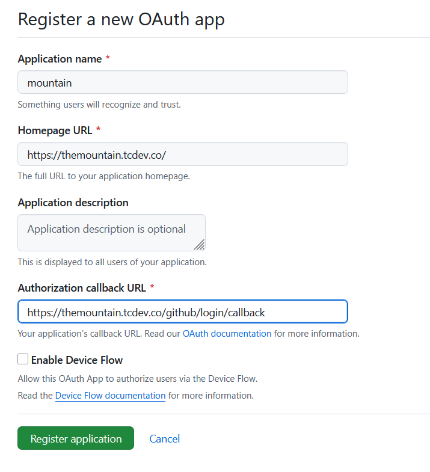

# tldraw sync: mountains

This is a simple example of a backend for [tldraw sync](https://tldraw.dev/docs/sync) with a Node.js Fastify server.

For dev mode, install dependencies and run `pnpm dev`.

For production mode, run `pnpm build` and then `pnpm serve`. For this mode, secrets must be added at src/server/secrets.ts:

```ts
const secrets = {
  githubClientId: "",
  githubClientSecret: "",
  githubAllowedUsers: ["[username]", "[username]"],
};

export default secrets;
```

Using the credentials from a Github app that's set up like this:



## License

This project is provided under the MIT license found [here](https://github.com/tldraw/tldraw/blob/main/apps/simple-server-example/LICENSE.md). The tldraw SDK is provided under the [tldraw license](https://github.com/tldraw/tldraw/blob/main/LICENSE.md).

## Trademarks

Copyright (c) 2024-present tldraw Inc. The tldraw name and logo are trademarks of tldraw. Please see our [trademark guidelines](https://github.com/tldraw/tldraw/blob/main/TRADEMARKS.md) for info on acceptable usage.

## Distributions

You can find tldraw on npm [here](https://www.npmjs.com/package/@tldraw/tldraw?activeTab=versions).

## Contribution

Please see our [contributing guide](https://github.com/tldraw/tldraw/blob/main/CONTRIBUTING.md). Found a bug? Please [submit an issue](https://github.com/tldraw/tldraw/issues/new).

## Community

Have questions, comments or feedback? [Join our discord](https://discord.tldraw.com/?utm_source=github&utm_medium=readme&utm_campaign=sociallink). For the latest news and release notes, visit [tldraw.dev](https://tldraw.dev).

## Contact

Find us on Twitter/X at [@tldraw](https://twitter.com/tldraw).
